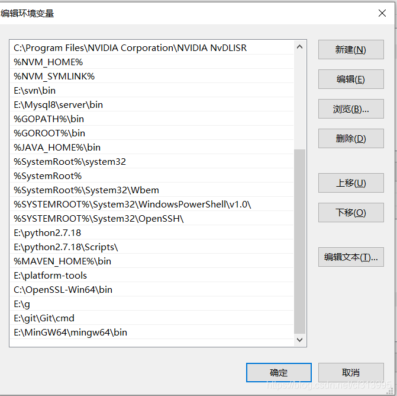
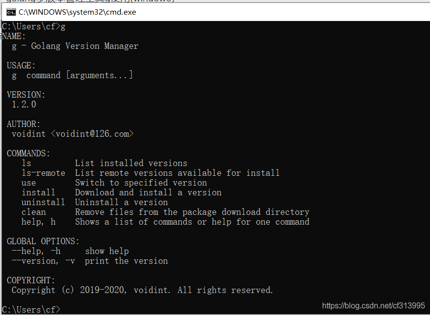

#### 1、下载地址

https://github.com/voidint/g/releases

#### 2、设置环境变量

G_MIRROR
值为
https://golang.google.cn/dl/
由于国内无法自由访问Golang官网，导致查询及下载go版本都变得困难，因此可以通过该环境变量指定一个镜像站点。

G_HOME
值为
E:\gvm
设置g的工作目录

GOROOT
值为
%G_HOME%\go

配置GOROOT，这个指向g工作目录下的go，g安装go版本后，会在这个路径下建立一个软链到versions目录下的指定版本，靠这个方法来控制当前的go版本，如果安装g之前已经安装过go了，需要修改GOROOT这个环境变量。

####  3、配置
为了方便使用，我们在E盘目录下建一个目录，然后通过环境变量指向到它，这样就可以使用命令行随时访问了。

将其添加到系统的path中

####  测试使用

####  4、使用

这里比较重要的一步，【以管理员身份运行命令行工具】，不管是CMD、还是powershell，都要以管理员身份运行！！！

不然，会出现【Symlink…A required privilege is not held by the client.】，就是无权创建软链，导致GOROOT指向的go目录不存在。

注：目前最新的1.2.0版本还无法实现自定义安装的目录，根据作者说的master分支已实现自定义目录的功能，试了确实可以。

其它命令

g ls 查询已安装的go版本
g ls-remote  查询可供安装的所有go版本
g ls-remote stable 查询当前可供安装的stable状态的go版本
g install 1.14.6 安装目标go版本1.14.6
g use 1.14.6 切换至1.14.6版本
g uninstall 1.14.6 卸载一个已安装的go版本
————————————————

原文链接：https://blog.csdn.net/cf313995/article/details/109517921

