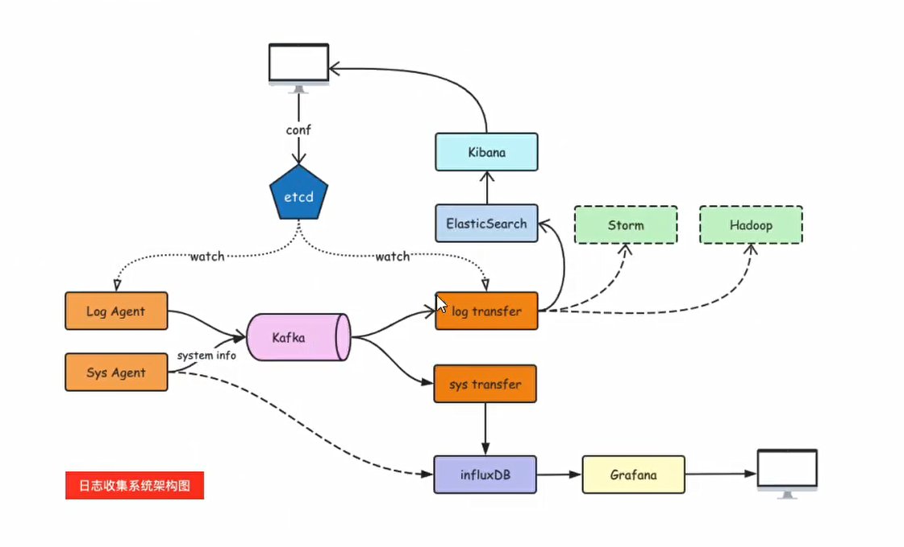

#### 3、Kafka选择分区的模式(3种)
1,指定往哪个分区写
2,指定key, kafka根据key做hash然后决定写哪个分区
3.轮询方式

####  4、生产者往kafka发送数据的模式(3种)
1、0:把数据发给leader就成功,效率最高、安全性最低,
2、1:把数据发送给leader,等待leader回ACK

3、2 :把数据发给leader,确保follower从leader拉取数据回复ack给leader, leader再回复ACK;安全性最高


5·分区存储文件的原理
6．为什么kafka快?
7·消费者组消费数据的原理


#### LogAgent的工作流程:

1、读日志一tailF第三方库

```go
package main

import (
	"fmt"
	"time"

	"github.com/hpcloud/tail"
)

func main() {
	fileName := "./my.log"

	config := tail.Config{
		ReOpen:    true,                                 //重新打开
		Follow:    true,                                 //是否跟随之前文件名，接着上一个切割地方继续读
		Location:  &tail.SeekInfo{Offset: 0, Whence: 2}, //文件那个地方开始读取
		MustExist: false,                                //不报错
		Poll:      true,
	}
	tails, err := tail.TailFile(fileName, config)
	if err != nil {
		fmt.Println("tail faile failed,err:", err)
		return
	}
	var (
		line *tail.Line
		ok   bool
	)
	for {
		line, ok = <-tails.Lines
		if !ok {
			fmt.Printf("tail file close reopen,filename:%s\n", tails.Filename)
			time.Sleep(time.Second)
			continue
		}
		fmt.Println("line", line.Text)
	}
}

```

2、往kafka写日志`sarama`第三方库

```go
package main

import (
	"fmt"
	"github.com/Shopify/sarama"
)

//基于sarama第三方库开发kafka client
func main() {
	config := sarama.NewConfig()
	//tailf包使用
	config.Producer.RequiredAcks = sarama.WaitForAll          //发完数据需要leader和follow都确认
	config.Producer.Partitioner = sarama.NewRandomPartitioner //选出一个partition
	config.Producer.Return.Successes = true                   //成功交付的消息将在success channel返回
	//构建一个消息
	msg := &sarama.ProducerMessage{}
	msg.Topic = "web_log"
	msg.Value = sarama.StringEncoder("this is atest log")
	//连接kafka
	client, err := sarama.NewSyncProducer([]string{"127.0.0.1:9092"}, config)
	if err != nil {
		fmt.Println("producer closed, err:", err)
		return
	}
	defer client.Close()
	//发送消息
	pid,offset,err:=client.SendMessage(msg)
	if err != nil {
		fmt.Println("send msg failed, err:", err)
		return
	}
	fmt.Printf("pid:%v offset:%v\n:", pid,offset)
}
```


sarama v1.20后加入zstd压缩算法，需要用到Cgo，在windows平台编译会提示错误

```
# github.com/DataDog/zstd
exec:"gcc":executable file not found in %PATH%
```

windows平台请使用v1.19版本sarama

查看kafka终端数据消费：

```
F:\kafka\kafka_2.13-2.8.0>bin\windows\kafka-console-consumer.bat --bootstrap-server=127.0.0.1:9092 -topic=web_log --from-beginning
```


#### etcd

